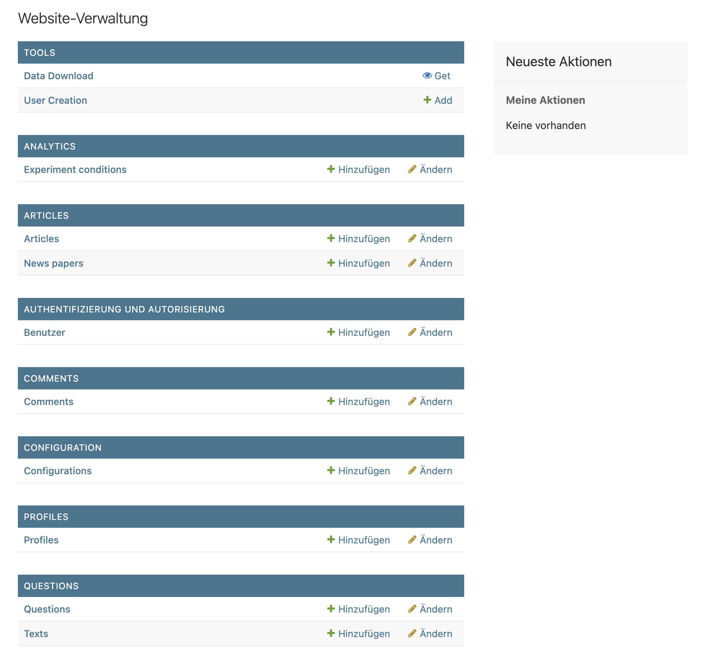

# Deployment-Anleitung

Diese Anleitung beschreibt, wie du das Projekt auf deinem Rechner startest. 

## Voraussetzungen

- **Git** muss installiert sein.
- **Docker** muss installiert sein.

Falls Docker noch nicht installiert ist, lade es hier herunter und installiere es:  
[https://www.docker.com/get-started](https://www.docker.com/get-started)

---

### 1. Repository klonen

Öffne ein Terminal und gib folgenden Befehl ein, um das Repo zu klonen und ins Projektverzeichnis wechseln

```sh
git clone [https://the-git.server/mirroronline.git] mirroronline
cd mirroronline
```

### 2. Docker-Compose verwenden:

   - Starte die Anwendung mit Docker-Compose:
     ```bash
     docker-compose up --build
     ```
   - Dieser Befehl baut die Docker-Images und startet die Container. Das kann einige Minuten dauern, da alle benötigten Abhängigkeiten installiert werden.


### 3. Anwendung im Browser aufrufen:*
   - Öffne einen Browser und gehe zu:
     ```
     http://127.0.0.1:8001/
     ```
   - Die Anwendung sollte nun erreichbar sein.

#### Alternative: Docker-Images ohne Docker-Compose starten

- Du kannst die Docker-Images auch ohne Docker-Compose starten. Kopiere dazu den folgenden Befehl ins Terminal:
  ```bash
  docker run -d \
    --name mirroronline \
    -p 8001:8000 \
    -v $(pwd)/data/:/ag4/data \
    mirroronline:latest

    Erklärung der Parameter:
	•	-d: Startet den Container im Hintergrund.
	•	--name mirroronline: Gibt dem Container den Namen „mirroronline“.
	•	-p 8001:8000: Leitet den internen Port 8000 auf Port 8001 auf deinem Rechner um.
	•	-v $(pwd)/data/:/ag4/data: Verbindet das lokale data/-Verzeichnis mit dem Verzeichnis /ag4/data im Container.
	•	mirroronline:latest: Verwendet das aktuellste Docker-Image „mirroronline“.


Info: Alle Instanzen erstellen beim ersten Start ein Datenverzeichnis unter ./data/ und kopieren ihre Vorlagen-Datenbank dorthin. Die Daten-Dateien repräsentieren die gesamte Instanz und können kopiert, ersetzt und gesichert werden. Sie bleiben auch bei der Zerstörung des Containers selbst erhalten.


Fertig! 🎉 Dein Projekt läuft jetzt lokal mit Docker. Falls Probleme auftreten, überprüfe die Fehlermeldungen im Terminal und stelle sicher, dass Docker korrekt installiert ist.

---

# Erste Schritte nach dem Deployment
<br>

Deine Instanz sollte nun unter der gewünschten Adresse und dem gewünschten Port laufen, z. B. `http://localhost:8001`. Bevor du nun loslegen kannst und Zeitungen und Artikel anlegen, benötigen wir einen **Admin-Account**. Anfangs gibt es noch keine Benutzerkonten im System, daher ist der **erste Schritt**, einen sogenannten **Superuser** zu erstellen:

<details><summary> Den Superuser anlegen </summary>

### **Schritt 1: Shell im Docker-Container öffnen**
- Identifiziere zunächst den Namen des Django-Containers, der deine Anwendung ausführt:
```bash
  docker ps
```
- Öffne eine Shell im Container:
``` bash
docker exec -it <container_name> bash
```
Ersetze <container_name> durch den Namen deines Django-Containers.

### **Schritt 2: Superuser erstellen**
Führe den folgenden Befehl aus, um einen neuen Superuser zu erstellen:
```bash
python manage.py createsuperuser
```

Du wirst aufgefordert, die folgenden Details einzugeben:
**Benutzername:** Wähle einen Admin-Benutzernamen (z. B. admin).
**E-Mail:** Gib eine E-Mail-Adresse ein (optional).
**Passwort:** Setze ein sicheres Passwort und bestätige es.

Beispiel: 
```bash
Username (leave blank to use 'username'): admin
Email address: admin@example.com
Password: 
Password (again): 
Creating log: User=admin, Type=account_created, Data={'username': 'admin'}
Superuser created successfully.
```

### **Schritt 3: Mit dem neuen Superuser anmelden**

Sobald der Superuser erstellt wurde, kannst du dich mit den neuen Anmeldedaten im Admin-Panel anmelden:
- Das Admin-Panel ist unter `http://localhost:8001/admin` erreichbar.
- Verwende die oben angegebenen Admin-Anmeldedaten, um dich einzuloggen.
- Über das Admin-Panel kannst du Benutzer, Artikel, Kommentare und andere Daten verwalten.

</details>

---

<details><summary>Reguläre Benutzerkonten erstellen </summary>

Reguläre Benutzerkonten können direkt über das Admin-Panel erstellt werden:

- Gehe zu `http://localhost:8000/admin`.
- Navigiere zum Abschnitt Users.
- Klicke auf Add User.
- Fülle die erforderlichen Details aus (Benutzername, usw.).
- Speichere den Benutzer.
</details>

---


<details><summary>Die Datenbank weiter befüllen & Information zu Demo-Daten</summary>
Um die Datenbank korrekt zu befüllen, halte dich bitte an die folgende Reihenfolge:

1. Experiment Conditions
2. Configuration, Questions, Texts
3. Benutzerkonten
4. Zeitungen
5. Artikel
6. Kommentare
7. Sekundärkommentare (Replies)



  ### Demo-Daten

  Um das Tool und seine Möglichkeiten zu erkunden, sind im Ordner `data.demo` bereits Demo-Daten enthalten. 
  
  ####  Volumes in der `docker-compose.yml`

  In der `docker-compose.yml` Datei definiert der `volumes` Abschnitt, welche Verzeichnisse zwischen dem Host-System und dem Container geteilt werden. In unserem Fall:

  ```yaml
  volumes:
    - ./data.demo:/ag4/data
  ```

  bedeutet dies, dass das Verzeichnis `data.demo` auf deinem Host-System in das Verzeichnis `/ag4/data` im Container eingebunden wird.

  Hier ist eine detaillierte Erklärung:

  - **`data.demo`**: Dies ist der Pfad auf deinem Host-System. Das `./` bedeutet, dass es relativ zum Verzeichnis ist, in dem sich die `docker-compose.yml` Datei befindet.
  - **`/ag4/data`**: Dies ist der Pfad im Container, in den das Host-Verzeichnis eingebunden wird.

  Wenn du die Demo-Daten nicht mehr nutzen möchtest und stattdessen ein eigenes Projekt starten willst, musst du den `data.demo` Ordner durch einen eigenen Ordner auf deinem System ersetzen. Dieser Ordner wird dann in den Container gespiegelt. Wenn du den Container killst, bleiben die Daten in dem ausgewählten Ordner auf deinem System erhalten, da sie nur gespiegelt werden.
  
  
  Die bereitgestellten Demo Daten beinhalten:

  1. **Experiment Conditions**:
    - `ChangeMe`: Wird automatisch erstellt, wenn sich der Admin anmeldet und noch keine Bedingungen festgelegt wurden. Diese sollte umbenannt werden und dient nur zu Übungszwecken.
    - `Experiment 1`
    - `Experiment 2`

  2. **Standardkonfiguration, Beispiel-Fragen und deutsche Versuchstexte**:
    - Drei Fragen: Slider, Ampel und Multiple Likert mit unterschiedlichen Labels (before und after).
    - Einverständniserklärung (Deutsch)
    - Abschluss-Header (Deutsch)
    - Abschluss-Nachricht (Deutsch)
    - Keine Einwilligung (Deutsch)
    - Teilnehmerinformationen-Header (Deutsch)
    - Teilnehmerinformationen-Nachricht (Deutsch)

  3. **Benutzer**:
    - `adminuser`
    - `testuser`
    - `tom`
    - `matella`
    - Passwort für alle Benutzer: `fb_apfel`

  4. **Zeitungen**:
    - Zwei Zeitungen ohne Condition-Zuweisung

  5. **Artikel**:
    - Drei Artikel pro Zeitung ohne Condition-Zuweisung

  6. **Kommentare**:
    - Unterschiedliche Kommentare je nach Versuchsbedingung.
    - Tom (Versuchsbedingung `exp2`) kann den Kommentar von Matella (Tag `exp2`) lesen.
    - TestUser (Versuchsbedingung `exp 1`) kann diesen Kommentar nicht sehen.

  7. **Sekundärkommentare**:
    - Ein Sekundärkommentar von Tom, zugeordnet zur Bedingung `exp2`.

  ### Media Ordner:
  - `avatar_default.png`: Standard-Profilbild
  - `articles`: Ordner für Artikel
  - `profile_pictures`: Ordner für Profilbilder

  ### `db_sqlite3` Datenbank:
  - Enthält die oben genannten Demo-Daten.


</details>

<details><summary> Debug Mode / Static Files </summary
>
### 

Die Anwendung wird statische Dateien im Produktionsmodus mit der WhiteNoise-Middleware bereitstellen. Damit dies funktioniert, müssen die statischen Dateien vorher gesammelt werden.

Für Entwicklungszwecke wird empfohlen, den `DEBUG_MODE` zu verwenden. Dies wird automatisch alle statischen Dateien ohne vorherige Sammlung bereitstellen, sodass sie während der Entwicklung sofort geändert und aktualisiert werden können. Zusätzlich wird im Fehlerfall eine detaillierte Fehlerbeschreibung angezeigt.
`DEBUG_MODE` kann aktiviert werden, indem die Umgebungsvariable `DEBUG_MODE=1` gesetzt oder in der `settings.py` geschrieben wird.

Alternativ kann der Produktionsmodus verwendet werden. Dies erfordert, dass du den folgenden Befehl ausführst:

```
python3 src/manage.py collectstatic
```

vorher und jedes Mal, wenn du eine Datei aktualisierst.

Der Docker-Build führt diesen Befehl automatisch aus (siehe hierzu `Dockerfile`)

**Verwende immer den Produktionsmodus in Produktionsumgebungen.**

</details>
</details>

---

### Weitere Dokumentation

Weitere Details zur Nutzung der Plattform und des Admin-Panels findest du im [HOW TO](./2-how-to.md)-Dokument.
Dort findest du Schritt-für-Schritt-Anleitungen und Details zum Aufbau der Software.

## Manuelles Deployment

Die Abhängigkeiten können installiert und die Software direkt ausgeführt werden. Dies ist nützlich für Entwicklungszwecke. Dies wird erreicht, indem eine virtuelle Umgebung erstellt, die erforderlichen Abhängigkeiten installiert und der Webserver wie folgt gestartet wird:

#### 1. **Virtualenv und Python 3 installieren**
Die Installation hängt von deinem Betriebssystem ab. Unter Linux (z. B. Ubuntu) kannst du folgende Befehle verwenden:

```shell
sudo apt install python3 python3-pip
sudo pip3 install virtualenv
```

#### 2. Repository klonen

Öffne ein Terminal und gib folgenden Befehl ein, um das Repo zu klonen und ins Projektverzeichnis wechseln

```sh
git clone [https://the-git.server/mirroronline.git] mirroronline
cd mirroronline
```

#### 3. Virtuelle Umgebung erstellen und aktivieren

Erstelle eine virtuelle Umgebung und aktiviere sie:

```sh
virtualenv .venv
source .venv/bin/activate
```

#### 4. Virtuelle Umgebung erstellen und aktivieren

Installiere die erforderlichen Abhängigkeiten:

```sh
pip install -r requirements.txt
```

#### 5. Static Files einsammeln

Sammle die statischen Dateien, damit sie in einer Produktionsumgebung bereitgestellt werden können:

```sh
python ./src/manage.py collectstatic
```

#### 5. Server starten

Entwicklungsserver starten.
```sh
python ./src/manage.py runserver 0.0.0.0:8000
```

Mit diesen Schritten kannst du die Software manuell auf deinem lokalen System bereitstellen. Dies ist besonders nützlich für Entwicklungs-  und Testzwecke. Stelle sicher, dass Python 3 und Virtualenv installiert sind, bevor du beginnst. Falls du Fragen hast oder auf Probleme stößt, konsultiere die Dokumentation oder wende dich an deinen Entwickler. 😊


### Hinweise der Fakebook Autoren zum Deployment:

- When using our tool for research purposes, please cite our paper: Voggenreiter, A; Brandt S; Putterer, F; Frings, A and Pfeffer J. The Role of Likes: How Online Feedback Impacts Users' Mental Health (2023).
  https://arxiv.org/abs/2312.11914

- Fakebook allows to setup a Social-Media-Environment, in which users can interact freely. Every interaction can be watched and controlled by the project maintainer (e.g. the researcher). The project maintainer is responsible for everything happening on his or her social media environment. The tool should be used in an ethical responsible manner. Study participants and other users of the social media environment have to be informed that all of their data can be inspected by the project maintainer. The project maintainers are responsible for clarifying the standards of acceptable and hatefree behavior and are expected to take appropriate and fair corrective action in response to any instances of unacceptable behavior. Project maintainers have the right and responsibility to remove, edit, or reject posts and comments, or to ban temporarily or permanently any user for other behaviors that they deem inappropriate, threatening, offensive, illegal or harmful.
