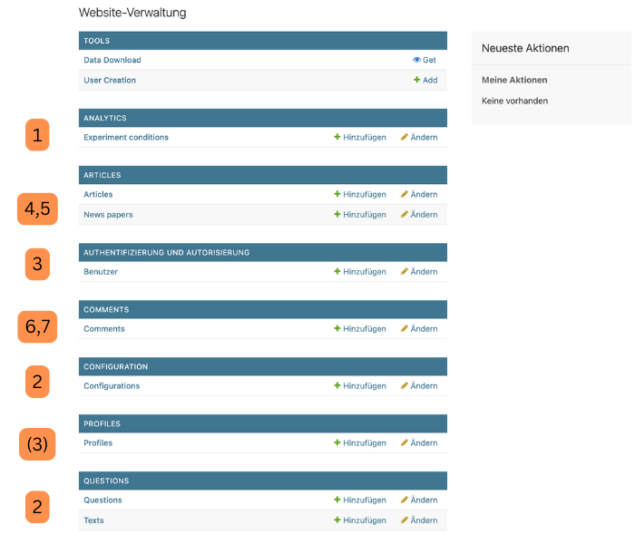

# Deployment-Anleitung

Diese Anleitung richtet sich an Nutzer, die das Projekt lokal mit Docker (oder auch manuell) ausführen möchten. Sie führt Schritt für Schritt durch den Prozess – von der Installation der benötigten Tools bis hin zum Starten der Anwendung.

## Voraussetzungen

- **Git** muss installiert sein.

Falls Git noch nicht installiert ist, lade es hier herunter und installiere es:  
[https://git-scm.com/downloads](https://git-scm.com/downloads)

- **Docker** muss installiert sein und ausgeführt werden.

Eventuell kann es zu Fehlern kommen, wenn das Python 3.8 Image nicht vorhanden ist. Um dies zu verhindern, führe diesen Befehl aus:
```
docker pull python:3.8
```


Falls Docker noch nicht installiert ist, lade es hier herunter und installiere es:  
[https://www.docker.com/get-started](https://www.docker.com/get-started)

Für das Deployment mit Docker benötigst du nur Git und Docker. Stelle sicher, dass beide korrekt installiert sind, bevor du beginnst.
Weitere Tools, die du benötigst, um an der Software zu arbeiten, findest du in [Glossary and Tools](./1-glossary-and-tools.md).

---

Sind Docker und Git installiert? Dann kann es jetzt losgehen! Öffne einen Editor deiner Wahl (z.B. Visual Studio Code):  
[https://code.visualstudio.com/](https://code.visualstudio.com/). 

### 1. Repository klonen

Öffne ein Terminal und gib folgenden Befehl ein, um das Repo zu klonen und ins Projektverzeichnis wechseln

```sh
git clone https://github.com/Julreut/ag4.git
cd ag4
```

### 2. Anwendung mit Docker-Compose starten:

   - Starte die Anwendung mit Docker-Compose:
     ```sh
     docker-compose up --build -d
     ```
     Dieser Befehl:
    - Erstellt und startet die Container.
    - Baut das Image neu, falls sich der Code geändert hat.
    - Läuft im Hintergrund (-d steht für „detached mode“).
    - Das kann einige Minuten dauern, da alle benötigten Abhängigkeiten installiert werden.

### 3. Anwendung im Browser aufrufen:
   - Öffne einen Browser und gehe zu:
     ```
     http://127.0.0.1:8001/
     ```
   - Die Anwendung sollte nun erreichbar sein.

#### Alternative: Docker-Images ohne Docker-Compose starten

- Du kannst die Docker-Images auch ohne Docker-Compose starten. Kopiere dazu den folgenden Befehl ins Terminal:
```sh
docker run -d \
  --name mirroronline \
  -p 8001:8000 \
  -v $(pwd)/data/:/ag4/data \
  mirroronline:latest
```

    Erklärung der Parameter:
	•	-d: Startet den Container im Hintergrund.
	•	--name mirroronline: Gibt dem Container den Namen „mirroronline“.
	•	-p 8001:8000: Leitet den internen Port 8000 auf Port 8001 auf deinem Rechner um.
	•	-v $(pwd)/data/:/ag4/data: Verbindet das lokale data/-Verzeichnis mit dem Verzeichnis /ag4/data im Container.
	•	mirroronline:latest: Verwendet das aktuellste Docker-Image „mirroronline“.


Info: Alle Instanzen erstellen beim ersten Start ein Datenverzeichnis unter ./data/ und kopieren ihre Vorlagen-Datenbank dorthin. Die Daten-Dateien repräsentieren die gesamte Instanz und können kopiert, ersetzt und gesichert werden. Sie bleiben auch bei der Zerstörung des Containers selbst erhalten.


Fertig! 🎉 Dein Projekt läuft jetzt lokal mit Docker. Falls Probleme auftreten, überprüfe die Fehlermeldungen im Terminal und stelle sicher, dass Docker korrekt installiert ist.

---

# Erste Schritte nach dem Deployment
<br>

Deine Instanz sollte nun unter der gewünschten Adresse und dem gewünschten Port laufen, z. B. `http://localhost:8001`. 

Bevor du nun loslegen kannst und Zeitungen und Artikel anlegen, benötigen wir einen **Admin-Account**. Es gibt zwei Möglichkeiten:

1. **Leere Datenbank**: Wenn du mit einer leeren Datenbank startest, gibt es noch keine Benutzerkonten im System. Der **erste Schritt** ist daher, einen sogenannten **Superuser** zu erstellen:
  - Folge den Anweisungen im Abschnitt "Den Superuser anlegen", um einen neuen Superuser zu erstellen.

2. **Nutzung von Demo-Daten**: Wenn du die bereitgestellten Demo-Daten verwendest, sind bereits Benutzerkonten im System vorhanden, und du kannst diesen Schritt überspringen. Die Demo-Daten beinhalten bereits einen Admin-Account sowie mehrere Testbenutzer.

Wähle die für dich passende Option und folge den entsprechenden Anweisungen.

<details><summary> Den Superuser anlegen </summary>

### **Schritt 1: Shell im Docker-Container öffnen**
- Identifiziere zunächst den Namen des Django-Containers, der deine Anwendung ausführt:
```sh
  docker ps
```
- Kopiere den Namen des Containers (Spalte NAMES).
- Öffne eine Shell im Container:
```sh
docker exec -it <container_name> bash
```
Hiermit öffnest du eine Shell im Container und startest danach den Befehl zum Anlegen eines Admin-Kontos. Ersetze <container_name> durch den Namen deines Django-Containers.

### **Schritt 2: Superuser erstellen**
Führe den folgenden Befehl aus, um einen neuen Superuser zu erstellen:
```sh
python manage.py createsuperuser
```

Du wirst aufgefordert, die folgenden Details einzugeben:
**Benutzername:** Wähle einen Admin-Benutzernamen (z. B. admin).
**E-Mail:** Gib eine E-Mail-Adresse ein (optional).
**Passwort:** Setze ein sicheres Passwort und bestätige es.

Beispiel:

```sh
Username (leave blank to use 'username'): admin
Email address: admin@example.com
Password: 
Password (again): 
Creating log: User=admin, Type=account_created, Data={'username': 'admin'}
Superuser created successfully.
```

### **Schritt 3: Mit dem neuen Superuser anmelden**

Sobald der Superuser erstellt wurde, kannst du dich mit den neuen Anmeldedaten im Admin-Panel anmelden:
- Das Admin-Panel ist unter `http://localhost:8001/admin` erreichbar.
- Verwende die oben angegebenen Admin-Anmeldedaten, um dich einzuloggen.
- Über das Admin-Panel kannst du Benutzer, Artikel, Kommentare und andere Daten verwalten.

</details>

---

<details><summary>Reguläre Benutzerkonten erstellen </summary>

Reguläre Benutzerkonten können direkt über das Admin-Panel erstellt werden:

- Gehe zu `http://localhost:8001/admin`.
- Navigiere zum Abschnitt Users.
- Klicke auf Add User.
- Fülle die erforderlichen Details aus (Benutzername, usw.).
- Speichere den Benutzer.
</details>

---

<details><summary>Die Datenbank weiter befüllen & Information zu Demo-Daten</summary>
Um die Datenbank korrekt zu befüllen, halte dich bitte an die folgende Reihenfolge:

1. Experiment Conditions
2. Configuration, Questions, Texts
3. Benutzerkonten
4. Zeitungen
5. Artikel
6. Kommentare
7. Sekundärkommentare (Replies)



  ### Demo-Daten

  Um das Tool und seine Möglichkeiten zu erkunden, sind im Ordner `data.demo` bereits Demo-Daten enthalten.

  #### Volumes in der `docker-compose.yml`
  Volumes ermöglichen es, Daten dauerhaft zu speichern, auch wenn der Container gelöscht wird.

  In der `docker-compose.yml` Datei definiert der `volumes` Abschnitt, welche Verzeichnisse zwischen dem Host-System (deinem Computer) und dem Container geteilt werden. In unserem Fall:

  ```yaml
  volumes:
    - ./data.demo:/ag4/data
  ```

  bedeutet dies, dass das Verzeichnis `data.demo` auf deinem Host-System in das Verzeichnis `/ag4/data` im Container eingebunden wird.

  Hier ist eine detaillierte Erklärung:

  - `data.demo`: Dies ist ein Ordner auf deinem Computer (Host-System). Das `./` zeigt an, dass er sich im gleichen Verzeichnis wie die `docker-compose.yml` Datei befindet. Der Ordner wurde erstellt, als du das Repository geklont hast.
  - `/ag4/data`: Dies ist der Ordner innerhalb des Containers, in den `data.demo` eingebunden wird. Der Container kann dadurch auf die Dateien zugreifen, als wären sie direkt in `/ag4/data` vorhanden.

  **Warum ist das wichtig?**

  Alles, was du in `data.demo` auf deinem Computer speicherst, ist automatisch auch im Container verfügbar. Umgekehrt bleiben die Daten erhalten, wenn der Container gestoppt oder gelöscht wird, da sie auf deinem Computer gespeichert sind und nicht nur innerhalb des Containers existieren.

  **Wie kann ich die Demo-Daten durch eigene Daten ersetzen?**

  Wenn du die Demo-Daten nicht mehr nutzen möchtest, kannst du den Ordner `data.demo` auf deinem Computer durch einen eigenen Ordner ersetzen. Ändere den `volumes`-Eintrag entsprechend in der `docker-compose.yml` Datei, damit dein neuer Ordner in den Container eingebunden wird.

  Dieser Ordner wird dann in den Container gespiegelt. Wenn du den Container killst, bleiben die Daten in dem ausgewählten Ordner auf deinem System **erhalten**, da sie nur gespiegelt werden.
  <br>
  Die bereitgestellten Demo Daten beinhalten:

  1. **Experiment Conditions**:
    - `ChangeMe`: Wird automatisch erstellt, wenn sich der Admin anmeldet und noch keine Bedingungen festgelegt wurden. Diese sollte umbenannt werden und dient nur zu Übungszwecken.
    - `Experiment 1`
    - `Experiment 2`

  2. **Standardkonfiguration, Beispiel-Fragen und deutsche Versuchstexte**:
    - Drei Fragen: Slider, Ampel und Multiple Likert mit unterschiedlichen Labels (before und after).
    - Einverständniserklärung (Deutsch)
    - Abschluss-Header (Deutsch)
    - Abschluss-Nachricht (Deutsch)
    - Keine Einwilligung (Deutsch)
    - Teilnehmerinformationen-Header (Deutsch)
    - Teilnehmerinformationen-Nachricht (Deutsch)

  3. **Benutzer**:
    - `adminuser`
    - `testuser`
    - `tom`
    - `jack`
    - `matella`
    - `juliane`
    - Passwort für alle Benutzer: `fb_apfel`

    - `juliane` simuliert eine Versuchsperson inkl. Event-Log

  4. **Zeitungen**:
    - Zwei Zeitungen ohne Condition-Zuweisung

  5. **Artikel**:
    - Drei Artikel pro Zeitung ohne Condition-Zuweisung

  6. **Kommentare**:
    - Unterschiedliche Kommentare je nach Versuchsbedingung.
    - Jack (zugeordnet zu Versuchsbedingung `exp2`) kann als einziger User den Kommentar von Matella (ebenfalls Tag `exp2`) lesen.
    - TestUser (Versuchsbedingung `exp 1`) kann diesen Kommentar bspw. nicht sehen.

  7. **Sekundärkommentare**:
    - Ein Sekundärkommentar von Tom, zugeordnet zur Bedingung `exp2`. Diesen kann folglich ebenfalls nur Jack lesen.

  8. **Configuration**
  - Drei verschiedene Beispiel Configuration Optionen. Eine davon ist auf `is_active` gesetzt. Der Timer läuft nach drei Minuten ab. 
  
  

  ### Media Ordner:
  - `avatar_default.png`: Standard-Profilbild
  - `articles`: Ordner für Artikel
  - `profile_pictures`: Ordner für Profilbilder

  ### `db_sqlite3` Datenbank:
  - Enthält die oben genannten Demo-Daten.

</details>

---

<details><summary> Weiterentwicklung im DEBUG Mode / Static Files </summary>

Die Anwendung wird statische Dateien im Produktionsmodus mit der WhiteNoise-Middleware bereitstellen. Damit dies funktioniert, müssen die statischen Dateien vorher mit `collectstatic` gesammelt werden.

Für Entwicklungszwecke wird empfohlen, den `DEBUG_MODE` zu verwenden. Dies wird automatisch alle statischen Dateien ohne vorherige Sammlung bereitstellen, sodass sie während der Entwicklung sofort geändert und aktualisiert werden können. Zusätzlich wird im Fehlerfall eine detaillierte Fehlerbeschreibung angezeigt.
`DEBUG_MODE` kann aktiviert werden, indem die Umgebungsvariable `DEBUG_MODE=1` gesetzt oder in der `settings.py` geschrieben wird.

Um die Demo_daten im Development zu nutzen, muss in der settings.py folgendes ein- bzw. auskommentiert werden:

```python
#for demo data usage: 
# DATA_DIRECTORY = "data.demo" #einkommentieren fuer local debugging in development
# Data directory
DATA_DIRECTORY = os.environ['DATA_DIRECTORY'] if 'DATA_DIRECTORY' in os.environ else "data"
```

Alternativ kann der Produktionsmodus verwendet werden. Dies erfordert, dass du den folgenden Befehl ausführst:

```
python3 src/manage.py collectstatic
```

vorher und jedes Mal, wenn du eine Datei aktualisierst.

Der Docker-Build führt diesen Befehl automatisch aus (siehe hierzu `Dockerfile`)

**Verwende immer den Produktionsmodus in Produktionsumgebungen.**

</details>
</details>

---

### Weitere Dokumentation

Weitere Details zur Nutzung der Plattform und des Admin-Panels findest du im [HOW TO](./2-how-to.md)-Dokument.
Dort findest du Schritt-für-Schritt-Anleitungen und Details zum Aufbau der Software.
