# Aufbau der Software+

### Tipps für Laien:
- Wenn du nicht sicher bist, wo du anfangen sollst, lies zuerst die Abschnitte "First Steps After Deployment" und "Umgang mit der Datenbank".
- Verwende das Glossar, um unbekannte Begriffe nachzuschlagen.
- Wenn du auf Probleme stößt, wende dich an deinen Entwickler oder konsultiere die Django-Dokumentation.

<details> <summary>Feature-Überblick</summary>

User:
- Artikel lesen: Zugriff auf veröffentlichte Zeitungsartikel.
- Kommentare schreiben: Artikel können kommentiert werden.
- Reaktionen: Kommentare können geliked und kommentiert werden.
- Benutzerprofile bearbeiten (Bio ändern).
- Andere Benutzerprofile und deren Bio ansehen.

Forschende:
- Hosting der Website: Anleitung dazu in Datei: ```deployment.md```.
- Nutzerinformationen einsehen: Name, User ID etc. (Passwörter sind nicht einsehbar).
- Nutzerverwaltung: Nutzer hinzufügen, entfernen und bearbeiten.
- Inhalte einsehen und bearbeiten: Zugriff auf Artikel, Kommentare, Likes und alle Interaktionen (über das Admin-Panel).
- Tracking-Daten einsehen: Verweildauer und Klickverhalten der Nutzer.
- Datenexport: Export der Daten als .xlsx-Datei (ausgewählte Tabellen oder gesamte Datenbank).
</details>

---

<details> <summary>Nutzerverwaltung für Forscher </summary>
Registrierung:

- Jede/r Nutzende kann sich direkt über die Registrierungsseite anmelden.
Nach dem Login haben Nutzende Zugriff auf die oben beschriebenen Features.

Admin-Zugriff:
- Forscher können über <URL>/admin auf die Administrationsseite zugreifen. 
- Login erfolgt mit Superuser-Zugangsdaten, die während der Einrichtung festgelegt wurden. Über die Admin-Seite können alle Module eingesehen und bearbeitet werden.
</details>

---

<details> <summary>🚀 Analytics App
</summary>

<br> TL;DR: Hier werden Nutzerdaten getrackt (User Event Log, Content Position) und Experimentalbedingung festgelegt.

- Admin Panel: 
    - Experiment Conditions: Hier werden die Experiment-Conditions festgelegt (falls vorhanden). Bisher werden nur die Zeitungen nach den Conditions gefiltert.

- Dateien: 
    - ```admin.py``` legt fest, wie die Conditions bearbeitet werden können.
    - ```models.py``` definiert Datenbanktabellen fuer 1. allgemeinen User Event Log, 2. Content Position (Anzeigeposition Artikel, Zeitung etc.) fuer jeweiligen User, 3. ExperimentCondition
    - ```urls.py``` enthaelt URL fuer Javascript User Event Logging
    - ```utils.py``` create_event_log erstellt einen UserEventLog-Eintrag mit validierten JSON-Daten
    - ```views.py``` log_user_action loggt Javascript User Actions
</details>

---

<details> <summary> 🗞️ Articles App (Zeitungen und Artikel)
</summary>
<br> TL;DR: Hier passiert die Verwaltung und Darstellung von Zeitungen und Artikeln. Das Admin-Panel ermöglicht die dynamische Anpassung und CSV-Exporte. Die Models definieren die Struktur von Zeitungen und Artikeln, und die Templates sorgen für die Anzeige von Listen und Details.

## Admin Panel:
- **Zeitungen und Artikel verwalten**: Hier können Zeitungen und Artikel bearbeitet und verwaltet werden. Zusätzlich können Experiment-Conditions für Tags dynamisch aus einer separaten Tabelle (`ExperimentCondition`) geladen werden.
- **CSV-Export**: Es ist möglich, Daten zu Zeitungen und Artikeln als CSV-Datei herunterzuladen.

## Dateien:
- ```admin.py```: 
  - Legt fest, wie Zeitungen und Artikel im Admin-Panel bearbeitet werden können.
  - Ermöglicht den CSV-Export von Artikeln und Zeitungen.
  - Dynamische Dropdown-Menüs für Tags basierend auf den `ExperimentCondition`-Daten.

- ```models.py```:
  - Definiert die Datenbanktabellen für:
    1. **NewsPaper**: Enthält Informationen zu Zeitungen wie Name, Bild und Tag.
    2. **Article**: Enthält Informationen zu Artikeln wie Titel, Inhalt, Slug, Bild und zugehörige Zeitung.
  - Beide Modelle bieten Methoden zur Generierung von `absolute_url`-Links und zur automatischen Erstellung von Slugs.

- ```urls.py```:
  - Enthält die URLs für:
    1. **Alle Zeitungen anzeigen** (`/`).
    2. **Artikel einer Zeitung auflisten** (`/article_list/<int:news_paper_id>/`).
    3. **Detailansicht eines Artikels** (`/<int:news_paper_id>/<slug:slug>/`).

- ```apps.py```:
  - Registriert die App unter dem Namen `'articles'`.

## Templates:
- **`all_articles.html`**: Listet alle Artikel einer spezifischen Zeitung.
- **`detailed_article.html`**: Zeigt die Detailansicht eines Artikels.
- **`news_papers.html`**: Zeigt eine Übersicht aller Zeitungen.

</details>

---

<details> <summary>💬 Comments App</summary>

<br> **TL;DR:** Die Comments App ermöglicht es Benutzern, Kommentare zu Artikeln zu verfassen, zu liken/disliken, und in einer strukturierten Ansicht darzustellen. Es werden sowohl Haupt- als auch Sekundärkommentare (Antworten) unterstützt.

- **Admin Panel:**
    - Kommentare verwalten:
        - Kommentare können als öffentlich oder privat markiert werden. Öffentliche Kommentare sind sichtbar für alle Nutzer. Private Kommentare sind nur für den jeweiligen Autor selbst sichtbar.
        - Experimentelle Bedingungen (`tag`) können dynamisch zugewiesen werden. (Still TODO das in den views zu hinterlegen)
        - Likes und Dislikes werden detailliert angezeigt und gefiltert.

- **Dateien:**
    - **`article_comments.html`**: Template für die Haupt-Kommentarseite eines Artikels. 
        - Zeigt Hauptkommentare und deren Antworten an.
        - Ermöglicht das Liken/Disliken und Hinzufügen neuer Kommentare.
    - **`detailed_comment.html`**: Template für die Detailansicht eines Kommentars.
        - Zeigt einen spezifischen Kommentar und seine Antworten.
        - Ermöglicht das Hinzufügen von Sekundärkommentaren.
    - **`admin.py`**: 
        - Registriert Modelle (`Comment`, `Like`, `Dislike`) im Admin-Bereich.
        - Ermöglicht schnelles Erstellen von Kommentaren.
    - **`forms.py`**:
        - Stellt Formulare für Haupt- und Sekundärkommentare bereit, inklusive dynamischer Felder.
    - **`models.py`**:
        - `Comment`: Hauptmodell für Kommentare, unterstützt hierarchische Strukturen (Antworten).
        - `PlannedReaction`: Ermöglicht geplante Reaktionen auf Kommentare.
        - `Like` & `Dislike`: Modelle zur Verwaltung von Reaktionen.
    - **`urls.py`**:
        - Definiert Routen für:
            - Kommentarseiten eines Artikels.
            - Detailansicht eines spezifischen Kommentars.
            - Like/Dislike-Aktionen.
    - **`views.py`**:
        - `article_comments_view`: 
            - Lädt Hauptkommentare in zufälliger, aber stabiler Reihenfolge.
            - Unterstützt das Hinzufügen von Haupt- und Sekundärkommentaren.
        - `detailed_comment_view`: 
            - Zeigt Details eines einzelnen Kommentars und seiner Antworten an.
            - Ermöglicht das Antworten auf Kommentare.
        - `like_unlike_comment` & `dislike_undislike_comment`:
            - Verarbeiten Like/Dislike-Aktionen und loggen Änderungen.
</details>

---

<details> <summary>🔧 Configuration App</summary>

<br>

**TL; DR:**
Die **Configuration App** ermöglicht die zentrale Verwaltung wichtiger Einstellungen der Versuchsumgebung. Diese Konfigurationen können flexibel angepasst werden, ohne den Code selbst zu verändern.

---

### Features

1. **Zentrale Konfigurationsparameter:**
   - Like/Dislike-Funktionalität aktivieren oder deaktivieren.
   - Sitzungs-Timer an/ausschalten.
   - Maximale Sitzungsdauer festlegen.

2. **Django Admin-Integration:**
   - Konfigurationsparameter direkt im Admin-Bereich verwalten.

3. **Automatische Token-Generierung:**
   - Verwaltungstoken (`management_token`) regenerieren, um zusätzliche Sicherheit zu gewährleisten.

---

### Admin.py

Die `admin.py` definiert, wie die Konfiguration im Django Admin angezeigt und verwaltet wird.

#### Eigenschaften:
- **Liste der anzeigbaren Felder (`list_display`)**:
  - `like_dislike_enabled`: Aktiviert/Deaktiviert die Like/Dislike-Funktionalität.
  - `is_timer_enabled`: Steuert, ob der Sitzungs-Timer aktiv ist.
  - `max_session_duration`: Maximale Sitzungsdauer in Sekunden.
  - `management_token`: Ein zufälliger Token für Verwaltungsaufgaben.

### Models.py

Die **Configuration-Modellklasse** definiert die Konfigurationsparameter und deren Standardwerte.

### Felder
1. **like_dislike_enabled**: Steuert, ob Likes/Dislikes aktiv sind.
2. **is_timer_enabled**: Aktiviert oder deaktiviert den Sitzungs-Timer.
3. **max_session_duration**: Maximale Dauer der Sitzung in Sekunden (Standard: 3600 Sekunden = 1 Stunde).
4. **management_token**: Verwaltungstoken, das für administrative Zwecke generiert wird.

### Methoden
- **regenerate_mgmt_token()**:
  - Generiert ein neues Token aus zufälligen Zeichen.
- **get_the_config()**:
  - Lädt die bestehende Konfiguration oder erstellt eine neue Standardkonfiguration.
- **ensure_config_exists()**:
  - Stellt sicher, dass eine Konfiguration in der Datenbank existiert.

## Hinweis: 
Wenn mehrere Configurations bestehen, wird einfach über `Configuration.objects.first()` die erste Konfiguration aus der Datenbank zurückgegeben (nach der Spalte id).

Wenn keine Konfiguration vorhanden ist (config is None), erstellt der Code eine neue Konfiguration mit Standardwerten:

```bash
like_dislike_enabled=True

is_timer_enabled=False

max_session_duration=1800 (30 Minuten).
```
**Management-Token-Logik:** Wenn das management_token den Wert "changeme" hat, wird es mit config.regenerate_mgmt_token() aktualisiert.
</details>

---


<details> 
<summary>📘 Fakebook App</summary>

<br> **TL;DR:** **TL;DR:** Kernstück der Anwendung im Backend src-folder zur Verwaltung von Benutzerdaten, Interaktionen und Experimentbedingungen.

---

### **Funktionalitäten**

- **Benutzerverwaltung**:
  - Registrierung und Anmeldung mit optionaler Anpassung von Benutzerprofilen.
  - Benutzer können über das Admin-Panel manuell erstellt werden.

- **Interaktionen**:
  - Beiträge (Posts), Kommentare, Likes und Dislikes sind zentrale Funktionen.
  - Aktivitäten wie das Betrachten von Beiträgen und Interaktionen werden für Analysen geloggt.

- **Datenexport**:
  - Ermöglicht den Export der Datenbank (CSV, XLSX, SQLite).
  - Exportiert auch hochgeladene Bilder oder andere Mediendateien.

- **Zeiterfassung**:
  - Ein Middleware-basierter Timer erfasst die Verweildauer der Benutzer auf spezifischen Seiten und leitet bei Überschreiten der Zeit zur nächsten Experimentphase weiter.

---

### **Admin Panel:**
- **Nutzererstellung**:
  - Admins können Benutzer und Profile direkt über ein spezielles Interface erstellen.
- **Datenexport**:
  - Tools zum Herunterladen der Datenbank und spezifischer Tabellen.
- **Sitzungskonfiguration**:
  - Anpassung der maximalen Sitzungsdauer und Aktivierung/Deaktivierung des Timers.

---

### **Dateien**

#### **`urls.py`**
Definiert Routen für verschiedene Funktionen:
- **Benutzererstellung**:
  - `/admin/user_creation_view` – Formular für die Benutzererstellung.
- **Datenexport**:
  - `/admin/download_xlsx` – Export von Datenbanktabellen als XLSX.
  - `/admin/download_database` – Download der gesamten SQLite-Datenbank.
  - `/admin/download_pictures` – Herunterladen von Mediendateien (z. B. Profilbilder).
- **Allgemeine Navigation**:
  - Verlinkung der Apps `profiles`, `questions`, `comments`, etc.

#### **`views.py`**
- **`home_view`**:
  - Startpunkt der App, leitet Benutzer basierend auf ihrem Status (z. B. Admin oder Teilnehmer) weiter.
- **`user_creation_view`**:
  - Ansicht zur Benutzererstellung durch Admins.
- **`download_xlsx`**:
  - Generiert eine XLSX-Datei mit ausgewählten Datenbanktabellen.
- **`download_database`**:
  - Stellt die SQLite-Datenbank als Download bereit.
- **`download_pictures`**:
  - Komprimiert Mediendateien (z. B. Bilder) in ein ZIP-Archiv und stellt sie zum Download bereit.

#### **`middleware.py`**
- **NewspaperTimerMiddleware**:
  - Verfolgt die Verweildauer von Benutzern ab Start des Experiments (nach Beantwortung der Fragen mit Label "before").
  - Automatische Weiterleitung zu "after" Fragen bzw. Ende des Experiments nach Ablauf der maximalen Sitzungszeit.

#### **`settings.py`**
- Definiert globale Einstellungen der Fakebook App:
  - **Datenbank**: SQLite als Standard.
  - **Statische Dateien**:
    - Statische Inhalte (CSS, JS) und Mediendateien sind konfigurierbar.
  - **Zeitzonen und Sprache**:
    - Standardmäßig `en` als Sprache und UTC als Zeitzone. Sprache sollte noch weiter angepasst werden
  - **Externe Authentifizierung**:
    - Integration von `django-allauth` für Benutzerverwaltung.

---

### **Datenexport**

#### **`downloads.py`**
- Enthält Tools zum Erstellen von Download-Dateien:
  - **CSV-Export**:
    - Erstellt CSV-Dateien basierend auf Datenbanktabellen.
  - **XLSX-Export**:
    - Generiert Excel-Dateien mit ausgewählten Tabellen.
  - **Datenbank-Download**:
    - Stellt die gesamte SQLite-Datenbank als Datei bereit.
  - **Mediendateien**:
    - Komprimiert ausgewählte Mediendateien (z. B. Bilder) in ein ZIP-Archiv.

---

### **Wichtige Features für Versuchsleiter**

1. **Timer und Weiterleitung**:
   - Überwachung der Sitzungszeit mit automatischer Weiterleitung zu spezifischen Seiten.
   - Anpassbar über das `SessionConfig` Modell im Admin-Panel.

2. **Profilverwaltung**:
   - Automatisches Anlegen von Benutzerprofilen bei der Registrierung.
   - Verwaltung der Profilbilder und anderer Benutzerdaten.

3. **Export-Tools**:
   - Datenbanktabellen, Mediendateien und andere Daten können direkt heruntergeladen werden.

---

</details>

---

<details> <summary>👤 Profiles App</summary>

<br> **TL;DR:** Die Profiles App ermöglicht die Verwaltung von Benutzerprofilen, einschließlich Biografie, Profilbild und experimentellen Bedingungen. Sie bietet Funktionen zur Ansicht und Bearbeitung des eigenen Profils, zur Anzeige anderer Profile sowie zur automatischen Zuweisung von experimentellen Bedingungen bei der Anmeldung.

- **Admin Panel:**
    - **Profile Management:** 
        - Benutzerprofile können angezeigt, bearbeitet und als CSV exportiert werden.
        - Anzeigen von Details wie Benutzername, Biografie, Slug und experimentelle Bedingung.

- **Dateien:**
    - **`urls.py`**:
        - Definiert Routen für:
            - Eigenes Profil (`my_profile_view`)
            - Detailansicht einzelner Profile (`ProfileDetailView`).
    - **`views.py`**:
        - **`my_profile_view`**:
            - Ermöglicht die Ansicht und Bearbeitung des eigenen Profils.
            - Zeigt alle Kommentare des Nutzers an (nur explizit öffentliche für andere Benutzer).
        - **`ProfileDetailView`**:
            - Detailansicht eines Profils, inklusive Biografie und Kommentare.
    - **`models.py`**:
        - **`Profile`**:
            - Modell für Benutzerprofile mit Feldern wie `bio`, `avatar`, `slug` und `condition`.
            - Automatische Slug-Generierung für eindeutige Profil-URLs.
    - **`forms.py`**:
        - **`ProfileModelForm`**:
            - Formular zur Bearbeitung von Biografie und Profilbild.
    - **`signals.py`**:
        - **Benutzererstellung**:
            - Automatische Erstellung eines Profils und einer Zustimmungserklärung (`Consent`) bei Registrierung.
        - **Experimentbedingungen**:
            - Zuweisung einer zufälligen experimentellen Bedingung bei Login, falls noch nicht zugewiesen.
        - **Logging**:
            - Ereignisprotokollierung bei Benutzeranmeldung und -abmeldung, einschließlich IP-Tracking.
    - **`utils.py`**:
        - **`get_random_string`**:
            - Generiert zufällige Zeichenfolgen zur Sicherstellung eindeutiger Slugs.
    - **`admin.py`**:
        - Registrierung des `Profile`-Modells im Admin-Bereich mit CSV-Exportfunktion.

</details>

---

<details> <summary>❓ Questions App</summary>

<br> **TL;DR:** Die Questions App ist unser SoSciSurvey-Nachbau. Sie ermöglicht es, Fragebögen zu erstellen und zu verwalten, die vor und nach dem Experiment ausgefüllt werden. Sie unterstützt verschiedene Fragetypen, Einverständniserklärungen und benutzerdefinierte Endnachrichten. 

- **Admin Panel:**
    - **Question Management**:
        - Fragetypen (z. B. Dropdown, Likert-Skala, Slider) und Eigenschaften (z. B. Pflichtfrage, Min-/Max-Werte) können hier konfiguriert werden.
        - `choices`, `sub_questions` und `sub_choices` definieren Antwortmöglichkeiten für spezifische Fragetypen.
        - Fragetyp-spezifische Validierungen werden automatisch ausgeführt.
    - **Text Management**:
        - Texte für Einverständniserklärung, Endnachrichten und Teilnehmerinformationen werden über `Text` verwaltet. Diese sollten im HTML Format eingefuegt werden, um gute Lesbarkeit zu garantieren. Sichtbarkeit (`visibility`) der Texte steuert deren Anzeige im Frontend.
    - **Session Configuration**:
        - Maximale Sitzungsdauer und Timer (an/aus) können im `SessionConfig` Modell konfiguriert werden.

- **Dateien:**
    - **`urls.py`**:
        - Definiert Routen für verschiedene Phasen des Experiments:
            - Teilnehmerinformationen (`participant_info`)
            - Einverständniserklärung (`consent_form`)
            - Fragebögen vor/nach dem Experiment (`questions_before`/`questions_after`)
            - Abschlussseite (`experiment_end`).
    - **`models.py`**:
        - **`Question`**:
            - Ermöglicht die Definition von Fragen mit unterschiedlichen Typen und Antwortmöglichkeiten.
            - Fragetypen: `dropdown`, `slider`, `multiple_choice`, `single_choice`, u. a.
            - Validierungen: z. B. Pflichtfelder, Min-/Max-Werte.
        - **`Answer`**:
            - Speichert Antworten, einschließlich Sub-Fragen (z. B. bei Likert-Skalen).
        - **`Text`**:
            - Verwalten von statischen Texten für Consent-Formulare, Endseiten und Teilnehmerinformationen.
        - **`SessionConfig`**:
            - Timer- und Sitzungsdauer-Management.
    - **`views.py`**:
        - **`experiment_start`**:
            - Begrüßungsseite mit Optionen für Erst- und Wiederholungsteilnehmer.
        - **`participant_info`**:
            - Zeigt konfigurierbare Teilnehmerinformationen an (`Text` Modell).
        - **`consent_form`**:
            - Zeigt die Einverständniserklärung an und verarbeitet die Auswahl.
            - Redirect bei Zustimmung oder Ablehnung.
        - **`question_list`**:
            - Dynamische Anzeige von Fragebögen basierend auf Labels (`before`, `after`).
            - Unterstützung für verschiedene Fragetypen (Dropdown, Likert, Slider).
            - Beantwortungspflicht wird validiert.
        - **`experiment_end`**:
            - Abschlussnachricht mit Logout-Option.
        - **`not_eligible`**:
            - Zeigt eine Nachricht für nicht teilnahmebereite Personen an.
    - **`templates/`**:
        - **`consent_form.html`**: Einverständniserklärung mit Auswahlmöglichkeit (Ja/Nein).
        - **`question_list.html`**: Dynamischer Fragebogen mit Fortschrittsanzeige.
        - **`end.html`**: Abschlussseite des Experiments.
        - **`participant_info.html`**: Informationen für Teilnehmer.
        - **`start.html`**: Begrüßungsseite für die Studie.
        - **`not_eligible.html`**: Nachricht für Teilnehmer, die die Einverständniserklärung verweigern. Bei Ablehnung wird automatisch eine "Nicht teilnahmefähig"-Seite angezeigt. Consent-Status wird im Modell `Consent` gespeichert.
    - **`utils.py`**:
        - **`calculate_questionnaire_duration`**:
            - Berechnet die Dauer für das Ausfüllen eines Fragebogens basierend auf Event-Logs. (Still TODO)

## Weitere Hinweise:

#### Anpassbare Texte:
- Texte für Consent-Formulare, Endnachrichten und Teilnehmerinformationen können im Admin-Bereich (Modell `Text`) bearbeitet werden.
- Die Sichtbarkeit (`visibility`) steuert, welche Texte im Frontend angezeigt werden.

#### Timer und Sitzungskonfiguration:
- Sitzungsdauer (`max_duration`) und Timer können über das Modell `SessionConfig` angepasst werden.

#### Debugging und Logs:
- Änderungen an Fragen werden im Admin-Bereich geloggt.
- Event-Logs (z. B. `questions_started`, `questions_completed`) sind verfügbar für Analysen.

#### Vollständiger Ablauf:
1. Start: Begrüßung und Teilnehmerinfo.
2. Login (Start des Trackings)
3. Vor-Experiment-Fragen → Experiment → Nach-Experiment-Fragen
4. Abschlussseite.

</details>

---

<details> <summary>🗂️ Static Project & Templates</summary>

### **Static Project**
Das Verzeichnis `static_project` enthält alle statischen Dateien, die für das Frontend benötigt werden, einschließlich CSS, JavaScript und Bilder. Statische Dateien werden genutzt, um Styles, Interaktivität und visuelle Assets bereitzustellen, die für die Benutzererfahrung relevant sind.

#### **Unterverzeichnisse:**
1. **`css/`**:
    - Enthält Stylesheets für verschiedene Bereiche und Funktionen der Anwendung:
        - **`articles.css`**: Styling für Artikelansichten.
        - **`base.css`**: Basis-Styling für die gesamte Anwendung.
        - **`comments.css`**: Styling für die Kommentaransichten.
        - **`experiment.css`**: Spezielle Styles für Experiment-bezogene Seiten.
        - **`login-signup-custom-style.css`**: Anpassungen für die Login- und Registrierungsseiten.
        - **`newspaper.css`**: Styling für Zeitungsansichten.
        - **`questions.css`**: Styles für Fragebögen.
        - **`style.css`**: Generelle Styles.
        - **`grid.css`**: Grid-Layout-Styles für die Anordnung von Elementen.
    - **Favicons**:
        - `favicon.ico` und `favicon2.ico` dienen als kleine Icons für den Browser-Tab der Website.

2. **`js/`**:
    - **`log.js`**: JavaScript-Datei für Logging-Funktionen (z. B. Nutzerinteraktionen).
    - **`main.js`**: Haupt-JavaScript-Datei für allgemeine Interaktivität und Logik.

---

### **Templates**
Das `templates`-Verzeichnis enthält HTML-Dateien, die das Frontend der Anwendung definieren. Es ist in verschiedene Unterverzeichnisse organisiert:
- **`account/`**: Templates für Login, Registrierung und Konto-Verwaltung.
- **`admin/`**: Templates für den Admin-Bereich.
- **`main/`**: Generelle Templates für Hauptseiten der Anwendung.
- **`base.html`**: Basis-Template, das von anderen Templates erweitert wird.
- **`lib-jquery.html`**: Einbindung von jQuery-Bibliotheken.
- **`ui-template-stylesheets.html`**: Template für die Einbindung von CSS-Dateien.

---

### **Django und `collectstatic`**
- **Statische Dateien in Django**:
    - Alle statischen Ressourcen, wie CSS, JavaScript und Bilder, werden im Entwicklungsmodus direkt aus dem `static_project`-Verzeichnis geladen.
    - Im Produktionsmodus werden alle statischen Dateien an einem zentralen Speicherort gesammelt.

- **Befehl `collectstatic`**:
    - Mit dem Befehl `python manage.py collectstatic` werden alle Dateien aus den `static`-Verzeichnissen in den in der `settings.py` definierten `STATIC_ROOT`-Ordner kopiert.
    - Dieser zentrale Speicherort ermöglicht die effiziente Bereitstellung der statischen Ressourcen durch einen Webserver (z. B. Nginx).

- **Wichtig für den Versuchsleiter:**
    - Änderungen an den CSS- oder JavaScript-Dateien im `static_project`-Verzeichnis erfordern einen erneuten Aufruf von `collectstatic`, damit die aktualisierten Dateien auf dem Produktionsserver verfügbar sind.
    - Der Speicherort für die statischen Dateien wird in den Django-Einstellungen mit `STATIC_ROOT` festgelegt.

---

### **Zusammenfassung**
Das `static_project`-Verzeichnis ist für die Bereitstellung und Verwaltung von Styles und Interaktivität verantwortlich. Durch das `templates`-Verzeichnis wird sichergestellt, dass die Benutzeroberfläche modular und erweiterbar bleibt. Der `collectstatic`-Prozess spielt eine entscheidende Rolle, um alle statischen Dateien für die Produktion zentral bereitzustellen.

</details>

---

<details> <summary> 🧭 Base Template und Navbar</summary>

<br> TL;DR: Das Base Template `base.html` dient als <strong> Grundgerüst für alle HTML-Dateien </strong> der Anwendung. Es enthält allgemeine Layout- und Design-Elemente, die in anderen Templates wiederverwendet werden. Alle spezifischen Seiten basieren auf diesem Template und ergänzen oder überschreiben dessen Inhalte mithilfe von **`` und ``**. Die Navigationsleiste `navbar.html` bietet Zugriff auf zentrale Funktionen wie die Navigation und wird ebenfalls auf allen Seiten eingebunden.


#### **Was passiert in `base.html`?**
1. **Grundstruktur**:
    - `<!doctype html>` definiert das Dokument als HTML5.
    - Das Template bindet wichtige **Meta-Tags** (z. B. für die mobile Ansicht) und Basis-Ressourcen ein.

2. **Statische Dateien**:
    - **CSS**: Mehrere Stylesheets für unterschiedliche Komponenten der Anwendung werden über `` eingebunden:
        - z. B. `style.css`, `articles.css`, `comments.css`.
    - **JavaScript**: Funktionen für Logging (`log.js`) und Interaktivität (`main.js`) werden ebenfalls eingebunden.

3. **Blöcke für Erweiterungen**:
    - **``**: Ermöglicht das Setzen eines individuellen Titels für jede Seite.
    - **``**: Hauptinhalt der Seite, der von spezifischen Templates überschrieben wird.
    - **``**: Ermöglicht das Einfügen von seitenabhängigen JavaScript-Funktionen.

4. **Navbar**:
    - Das Template bindet die Navigationsleiste (`navbar.html`) ein, die auf jeder Seite angezeigt wird. Enthalten darin ist eine Plattform-eigene Navigation (Vor und Zurück-Buttons).

5. **CSRF und URLs**:
    - Die **CSRF-Token** und wichtige URLs (z. B. `analytics:log_user_action`) werden als JavaScript-Variablen definiert, damit sie für Frontend-Skripte verfügbar sind.

#### **Warum ist `base.html` wichtig?**
- **Wiederverwendbarkeit**: Alle Templates bauen auf `base.html` auf. Änderungen an der Struktur oder dem Design müssen nur hier vorgenommen werden.
- **Erweiterbarkeit**: Mithilfe von **``** können Inhalte leicht angepasst werden, ohne die Grundstruktur zu verändern.

---

### **Navbar (`navbar.html`)**

#### **Funktionalität der Navbar:**
1. **Benutzerstatus**:
    - Wenn der Benutzer **nicht eingeloggt** ist, zeigt die Navbar nur eine Login-Option an.
    - Wenn der Benutzer **eingeloggt** ist:
        - Zeigt Links zu wichtigen Bereichen, wie **News-Papers**, **Profil** und **Experiment-Ende**.
        - Das Profilbild des Benutzers wird angezeigt.
        - Links zum Logout und zum Abbruch des Experiments stehen zur Verfügung.

2. **Timer-Funktion**:
    - Zeigt die verbleibende Zeit des Experiments an.
    - Wenn die Zeit abgelaufen ist, wird der Benutzer automatisch auf die Seite für **Nach-Experiment-Fragen** umgeleitet.

3. **Flexibilität**:
    - Die Navbar passt sich dynamisch basierend auf dem Benutzerstatus und der Sitzungskonfiguration (`MAX_SESSION_DURATION`) an.

---

### **Blöcke in Templates verwenden**
Templates, die auf `base.html` basieren, verwenden folgende Syntax, um Inhalte hinzuzufügen oder anzupassen:
- **``**: Setzt den Titel der Seite, z. B. "News-Papers".
- **``**: Fügt den Hauptinhalt der spezifischen Seite ein.
- **``**: Fügt zusätzliche JavaScript-Funktionen ein.

Beispiel:
```html


 Meine Seite 


<div>
  <h1>Willkommen!</h1>
  <p>Das ist eine spezifische Seite.</p>
</div>


<script>
  document.addEventListener('DOMContentLoaded', function() {
    const button = document.getElementById('clickMeButton');
    button.addEventListener('click', function() {
      document.getElementById('greeting').textContent = "Danke für deinen Klick!";
      button.disabled = true;
    });
  });
</script>

```
</details>

---

<details> <summary> ☞ manage.py in Django</summary>
<br> TL;DR:Die Datei `manage.py` ist ein zentraler Bestandteil jeder Django-Anwendung. Sie dient als **Schnittstelle für administrative Aufgaben** und wird verwendet, um verschiedene Befehle auszuführen.

---

#### **Hauptfunktionen:**
1. **Starten des Servers:**
```bash
python src/manage.py runserver
```
2. **Migrationen:**
```bash
python src/manage.py makemigrations
python src/manage.py migrate
```

3. **Statische Dateien sammeln:**
```bash
python src/manage.py collectstatic
```

4. **Interaktive Shell:**
```bash
python src/manage.py shell
```

5. **Alle Befehle anzeigen/ Hilfe:**
```bash
python src/manage.py help
```
</details>

---
<br>

# Hinweise für Versuchsleiter

<details><summary>Umgang mit der Datenbank</summary>

# Django-Datenbank: Verständnis und Zugriff auf Modelle

In diesem Abschnitt wird erklärt, wie die Django-Datenbank aufgebaut ist und wie du auf die verschiedenen Tabellen und Daten zugreifen kannst. Die Datenbank besteht aus mehreren Tabellen, die durch Modelle repräsentiert werden. Diese werden jeweils in der `models.py`festgelegt. Jede Tabelle entspricht einem Django-Modell, und die Beziehungen zwischen den Tabellen werden durch Fremdschlüssel (Foreign Keys) definiert.

---

Kurz erklärt: 

### So exportierst du Daten als Excel-Datei:
1. Gehe ins Admin-Panel.
2. Wähle die gewünschte Tabelle aus (z. B. `Comments Comment`).
3. Klicke auf `Exportieren` und wähle das Excel-Format.
4. Die Daten werden als Excel-Datei heruntergeladen.

--- 

## 1. **Datenbankstruktur**

Die Django-Datenbank besteht aus mehreren Tabellen, die miteinander verknüpft sind. Hier sind die wichtigsten Tabellen und ihre Beziehungen:

### **Benutzer und Profile**
- **`auth_user`**: Enthält alle Benutzerdaten wie Benutzername, automatisch generierte E-Mail, Passwort usw. Datenschutzhinweis: Das Passwort ist dabei stets anonym und verschlüsselt - also auch für Versuchsleitende nicht einsehbar!
- **`profiles_profile`**: Enthält zusätzliche Benutzerinformationen wie Bio, Avatar und eine Verknüpfung zum Benutzer (`auth_user`).

### **Artikel und Kommentare**
- **`articles_article`**: Enthält Artikel mit Titel, Inhalt, Veröffentlichungsdatum usw.
- **`comments_comment`**: Enthält Kommentare zu Artikeln. Jeder Kommentar ist mit einem Artikel (`articles_article`) und einem Benutzer (`profiles_profile`) verknüpft.

### **Fragen und Antworten**
- **`questions_question`**: Enthält Fragen, die Benutzern gestellt werden.
- **`questions_answer`**: Enthält Antworten auf Fragen. Jede Antwort ist mit einer Frage (`questions_question`) und einem Benutzer (`auth_user`) verknüpft.

### **Analytics und Logs**
- **`analytics_usereventlog`**: Protokolliert Benutzerereignisse wie Klicks oder Anmeldungen.
- **`analytics_experimentcondition`**: Enthält Informationen zu Experimenten, an denen Benutzer teilnehmen.

### **Weitere wichtige Tabellen**
- **`django_session`**: Speichert Benutzersitzungen.
- **`django_admin_log`**: Protokolliert Änderungen, die im Admin-Panel vorgenommen wurden.

---

## 2. **Zugriff auf die Datenbank**

### **Über das Django Admin-Panel**
- Du kannst auf alle Tabellen über das Django Admin-Panel zugreifen. Gehe dazu auf: `http://127.0.0.1:8000/admin/`
- Melde dich mit deinem Superuser-Account an. Wie du den Superuser erstellst, ist in der [Deployment-Dokumentation](./7-deployment.md) beschrieben.
- Jede Tabelle (Modell) wird als Eintrag im Admin-Panel angezeigt. Du kannst die Daten anzeigen, herunterladen oder löschen.

### **Daten als Excel exportieren**
- Im Admin-Panel kannst du die Daten jeder Tabelle als Excel-Datei exportieren:
1. Wähle die gewünschte Tabelle aus.
2. Klicke auf "Exportieren" und wähle das Excel-Format.
3. Die Daten werden als Excel-Datei heruntergeladen.

---

## 3. **Beziehungen zwischen den Tabellen**

### **Benutzer und Profile**
- Jeder Benutzer (`auth_user`) hat ein Profil (`profiles_profile`).
- Die Verknüpfung erfolgt über das Feld `user` in der `profiles_profile`-Tabelle.

### **Artikel und Kommentare**
- Jeder Artikel (`articles_article`) kann mehrere Kommentare (`comments_comment`) haben.
- Jeder Kommentar ist mit einem Artikel (`articles_article`) und einem Benutzer (`profiles_profile`) verknüpft.

### **Fragen und Antworten**
- Jede Frage (`questions_question`) kann mehrere Antworten (`questions_answer`) haben.
- Jede Antwort ist mit einer Frage (`questions_question`) und einem Benutzer (`auth_user`) verknüpft.

---

## 4. **Beispiel: Zugriff auf Benutzerdaten**

### **Benutzerdaten anzeigen**
- Gehe im Admin-Panel zu `Auth User`.
- Hier siehst du alle Benutzer mit ihren Details wie Benutzername, E-Mail (immer username@example.com) und Passwort.

### **Profile anzeigen**
- Gehe im Admin-Panel zu `Profiles Profile`.
- Hier siehst du die Profile der Benutzer mit Informationen wie Bio, Avatar und verknüpftem Benutzer.

---

## 5. **Beispiel: Zugriff auf Kommentare**

### **Kommentare anzeigen**
- Gehe im Admin-Panel zu `Comments Comment`.
- Hier siehst du alle Kommentare mit Informationen wie Inhalt, Autor und verknüpftem Artikel.

### **Kommentare exportieren**
- Wähle die `Comments Comment`-Tabelle aus und exportiere die Daten als Excel-Datei.

---

## 6. **Wichtige Hinweise**
- **Fremdschlüssel**: Verknüpfungen zwischen Tabellen werden durch Fremdschlüssel (Foreign Keys) hergestellt. Zum Beispiel ist das Feld `user` in der `profiles_profile`-Tabelle ein Fremdschlüssel zur `auth_user`-Tabelle.
- **Admin-Panel**: Das Admin-Panel ist der einfachste Weg, um auf die Daten zuzugreifen und sie zu verwalten.
- **Datenexport**: Du kannst die Daten jeder Tabelle als Excel-Datei exportieren, um sie weiter zu analysieren.

---

## 7. **Zusammenfassung**
- Die Django-Datenbank besteht aus mehreren Tabellen, die durch Modelle repräsentiert werden.
- Du kannst auf die Daten über das Admin-Panel zugreifen und sie als Excel-Dateien exportieren.
- Die Beziehungen zwischen den Tabellen werden durch Fremdschlüssel definiert.

Falls du weitere Fragen hast, schau gerne in die [Django-Dokumentation](https://docs.djangoproject.com/en/5.1/intro/tutorial02/)! 😊
</details>

---

<details><summary>❓ Fragetypen im `Question`-Modell</summary>

Dieser Abschnitt der Dokumentation beschreibt, welche Felder für die einzelnen Fragetypen (`question_type`) im `Question`-Modell ausgefüllt werden müssen.

### Allgemein
- **Pflichtfragen:** Das Feld `required` kann für jeden Fragetyp genutzt werden, um anzugeben, ob eine Antwort zwingend notwendig ist.
- **Anzeigeposition:** Das Feld `order` bestimmt die Anzeigeposition der Frage. Fragen mit niedrigeren Werten erscheinen zuerst.
- **Globaler Hinweis zu `choices`, `sub_choices`,`sub_questions`:** Für alle Fragen, die `choices` verwenden, müssen die Optionen durch Semikolons getrennt angegeben werden. Daher können unterschiedliche Optionen keine Semikolons enthalten - das führt sonst zu einem Fehler. Auch kein Semikolon am Ende: Füge kein Semikolon nach der letzten Option oder Frage ein! Richtig: `Option1;Option2` `Falsch: Option1;Option2;`

### So erstellst du einen neuen Fragetyp:
1. Gehe ins Admin-Panel unter `Questions`.
2. Klicke auf `Add Question`.
3. Wähle den gewünschten Fragetyp aus (z. B. `Dropdown`).
4. Fülle die erforderlichen Felder aus:
   - `question_text`: Der Text der Frage.
   - `choices`: Die Antwortmöglichkeiten, getrennt durch Semikolons (z. B. `Option1;Option2;Option3`).
   - `sub_choices` und `sub_questions` müssen bei entsprechenden Fragetypen definiert werden. 
    - `sub_choices` definiert die Pole einer Ampelfrage (z. B. "positiv/negativ").
    - `sub_questions` definiert die Aussagen oder Fragen einer Multiple-Likert-Frage
  (...sh. Admin Panel)
5. Speichere die Frage.

<br>

<details>
<summary>1. Dropdown</summary>

- **Beschreibung:** Ermöglicht eine Auswahl aus einer Dropdown-Liste.
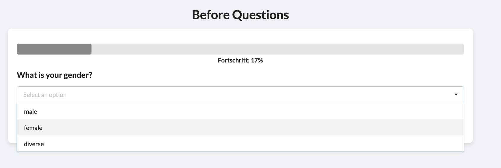

- **Erforderliche Felder:**
  - `choices`: Semikolon-separierte Auswahlmöglichkeiten (z. B. `Option1;Option2;Option3`).
- **Optional:** 
  - `required`: Gibt an, ob die Frage verpflichtend beantwortet werden muss.

### Beispiel für eine Dropdown-Frage:
- **Frage:** "Bitte wählen Sie einen der folgenden Altersabschnite aus:"
- **Antwortmöglichkeiten:** `18-25;26-35;36-45;46+`

</details>

---

<details>
<summary>2. Multiple Choice</summary>

- **Beschreibung:** Mehrere Auswahlmöglichkeiten können gleichzeitig ausgewählt werden.
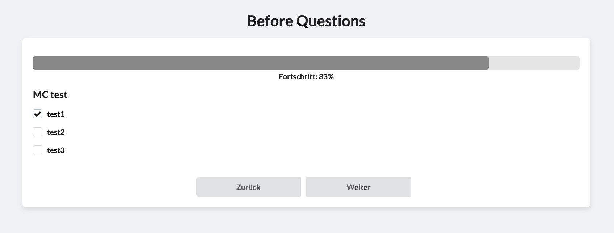

- **Erforderliche Felder:**
  - `choices`: Semikolon-separierte Auswahlmöglichkeiten (z. B. `Option1;Option2;Option3`).
- **Optional:** 
  - `required`: Gibt an, ob die Frage verpflichtend beantwortet werden muss.

</details>

---

<details>
<summary>3. Single Choice</summary>

- **Beschreibung:** Nur eine Auswahl aus mehreren Optionen ist erlaubt.
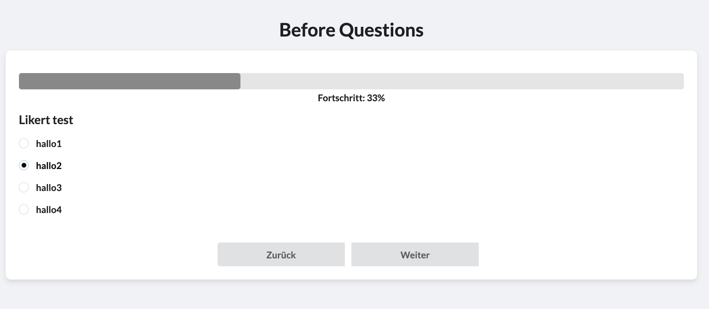

- **Erforderliche Felder:**
  - `choices`: Semikolon-separierte Auswahlmöglichkeiten (z. B. `Option1;Option2;Option3`).
- **Optional:** 
  - `required`: Gibt an, ob die Frage verpflichtend beantwortet werden muss.

- **Vorab-Hinweise:** 
-   Für einfache Vorab-Hinweise vor dem Experiment (oder auch danach) eignet sich das Frage-Format "Single Choice". Mehr Informationen dazu sh. Abschnitt "Texte im Question Modell"

</details>

---

<details>
<summary>4. Numeric Scale</summary>

- **Beschreibung:** Eine Frage mit numerischen Antworten, die eine obere und untere Grenze haben können (z. B. 18–99).
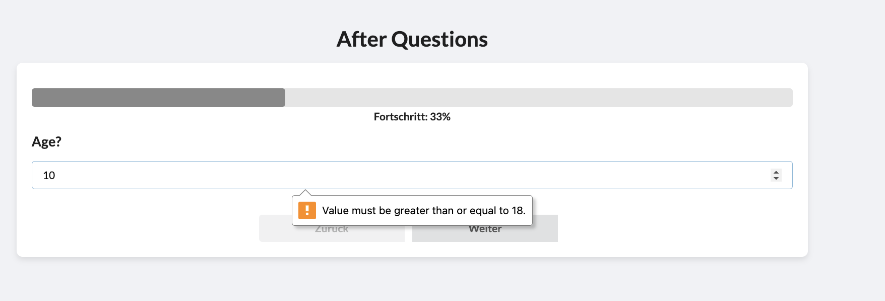

- **Erforderliche Felder:**
  - `min_value`: Der niedrigste Wert.
  - `max_value`: Der höchste Wert.
- **Optional:**
  - `required`: Gibt an, ob die Frage verpflichtend beantwortet werden muss.

</details>

---

<details>
<summary>5. Open Text</summary>

- **Beschreibung:** Ermöglicht eine offene Textantwort.
- **Erforderliche Felder:**
  - Keine spezifischen Felder notwendig.
- **Optional:** 
  - `required`: Gibt an, ob die Frage verpflichtend beantwortet werden muss.

</details>

---

<details>
<summary>6. Slider</summary>

- **Beschreibung:** Ein Schieberegler für die Auswahl eines Werts innerhalb eines definierten Bereichs.
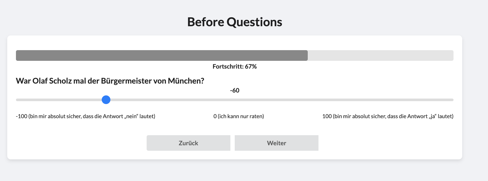
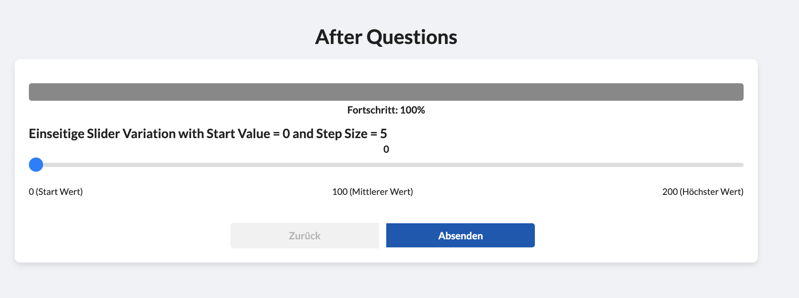

- **Erforderliche Felder:**
  - `min_value`: Minimaler Wert.
  - `max_value`: Maximaler Wert.
  - `step_value`: Schrittgröße des Reglers (z. B. 1, 5, 10).
  - `start_value`: Anfangsposition des Reglers.
- **Optional:** 
  - `required`: Gibt an, ob die Frage verpflichtend beantwortet werden muss.

</details>

---

<details>
<summary>7. Multiple Likert</summary>

- **Beschreibung:** Eine Matrixfrage mit mehreren Items (z. B. Aussagen), die auf einer Likert-Skala bewertet werden.
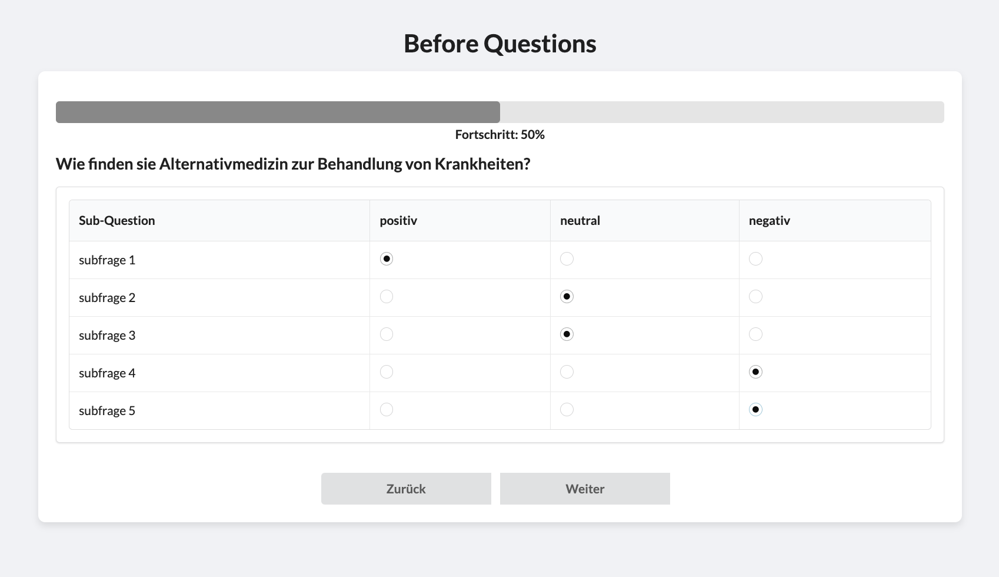+
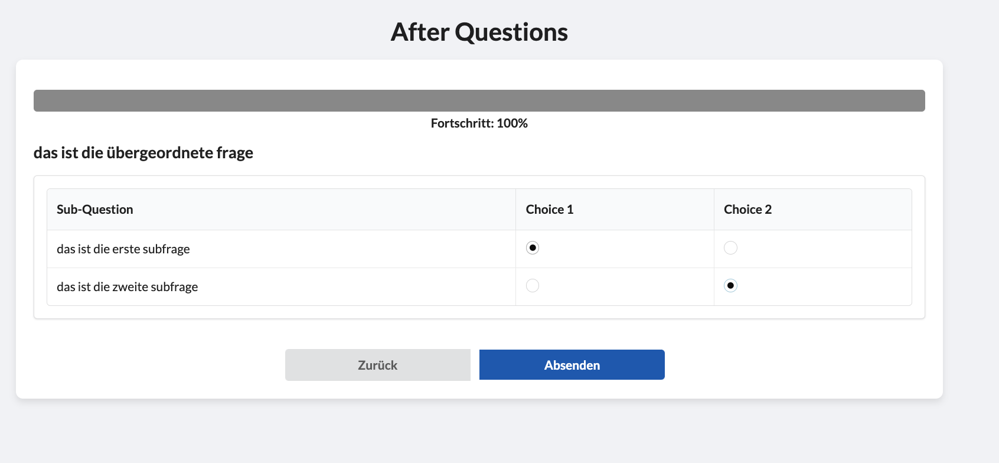

- **Erforderliche Felder:**
  - `sub_questions`: Semikolon-separierte Sub-Fragen (z. B. `Frage1;Frage2;Frage3`).
  - `choices`: Semikolon-separierte Bewertungskategorien (z. B. `Stimme nicht zu;Stimme zu`).
- **Optional:**
  - `required`: Gibt an, ob die Frage verpflichtend beantwortet werden muss.

</details>

---

<details>
<summary>8. Ampel Rating</summary>

- **Beschreibung:** Bewertung mit zwei Polen: <br>
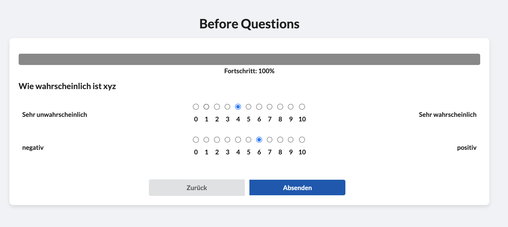

- **Erforderliche Felder:**
  - `sub_choices`: Muss eine gerade Anzahl an Optionen enthalten (z. B. `positiv;negativ` oder auch `positiv;negativ;gut;schlecht`). 

- **Optional:** 
  - `required`: Gibt an, ob die Frage verpflichtend beantwortet werden muss. <br>
  Warning Beispiel:<br>
    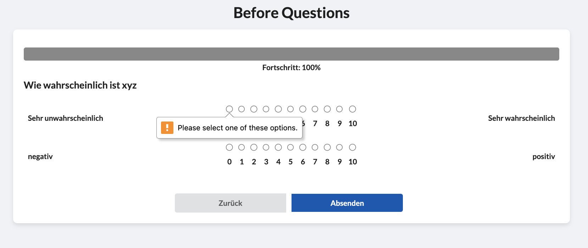
</details>
</details>

---

<details>
<summary>"Texte" im `Question`-Modell</summary>

### Anzeigen von VP-Hinweisen zur Experiment-Bearbeitung
- Für einfache Vorab-Hinweise vor dem Experiment (oder auch danach) eignet sich das `Frage-Format "Single Choice"`. Beispielsweise ist es wichtig, dazuzusagen, dass die VP die tool-interne Navigation nutzen sollten und nicht die Browser-Navigation. Wird diese doch genutzt, kommt es im Normalfall **nicht** zu technischen Problemen, jedoch kann dies das Logging verfälschen.


- **Hinweis:** Durch Angabe von `<h4 class="large-label">{{ question.question_text | safe }}</h4>` im HTML Template `question_list.hmtl` kann im Fragetext mit HTML gearbeitet werden. Dies ist stark zu empfehlen!! Sh. hierzu folgendes Beispiel mit HTML Text:

  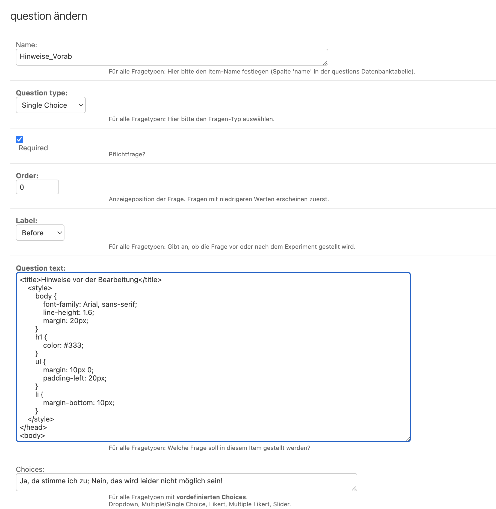
  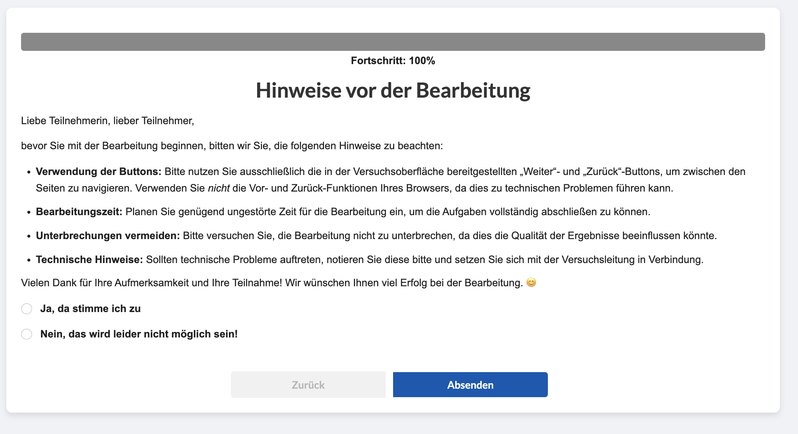

<details>
<summary>HTML Code</summary>

HTML Text sorgt dafür, dass der Content deutlich besser lesbar ist. Hierfür einfach den Plain Text in ChatGPT o.Ä. einfügen mit dem Prompt <br>

``` html
'Erstelle einen HTML-Text aus folgendem Plaintext: [Text hier einfügen]. Der Titel der Seite sollte [Titel] lauten. Der Haupttext soll in der Mitte der Seite stehen, mit einer  [Farbe hier einfügen] Überschrift und einer Beschreibung darunter. Füge auch eine Kontaktmöglichkeit per E-Mail hinzu. Die Seite soll ansprechend und responsiv gestaltet sein.'
```

```html
  <title>Anzeigen von Hinweisen vor oder nach dem Experiment</title>
    <style>
        body {
            font-family: Arial, sans-serif;
            line-height: 1.6;
            margin: 20px;
        }
        h1 {
            color: #333;
        }
        ul {
            margin: 10px 0;
            padding-left: 20px;
        }
        li {
            margin-bottom: 10px;
        }
    </style>
  </head>
  <body>
      <h1>Hinweise vor der Bearbeitung</h1>
      <p>Liebe Teilnehmerin, lieber Teilnehmer,</p>
      <p>bevor Sie mit der Bearbeitung beginnen, bitten wir Sie, die folgenden Hinweise zu beachten:</p>
      <ul>
          <li><strong>Verwendung der Buttons:</strong> Bitte nutzen Sie ausschließlich die in der Versuchsoberfläche bereitgestellten „Weiter“- und „Zurück“-Buttons, um zwischen den Seiten zu navigieren. Verwenden Sie <em>nicht</em> die Vor- und Zurück-Funktionen Ihres Browsers, da dies zu technischen Problemen führen kann.</li>
          <li><strong>Bearbeitungszeit:</strong> Planen Sie genügend ungestörte Zeit für die Bearbeitung ein, um die Aufgaben vollständig abschließen zu können.</li>
          <li><strong>Unterbrechungen vermeiden:</strong> Bitte versuchen Sie, die Bearbeitung nicht zu unterbrechen, da dies die Qualität der Ergebnisse beeinflussen könnte.</li>
          <li><strong>Technische Hinweise:</strong> Sollten technische Probleme auftreten, notieren Sie diese bitte und setzen Sie sich mit der Versuchsleitung in Verbindung.</li>
      </ul>
      <p>Vielen Dank für Ihre Aufmerksamkeit und Ihre Teilnahme! Wir wünschen Ihnen viel Erfolg bei der Bearbeitung. 😊</p>
  </body>
  ```

  </details>

---

### Weitere Texte: Teilnehmerinformation, Consent-Form, Not Eligible, Start-View und End-Viewzur Experiment-Bearbeitung

### So erstellst du einen HTML-Text im Admin-Panel:
1. Gehe ins Admin-Panel unter `Text`.
2. Klicke auf `Add Text`.
3. Fülle die Felder aus:
   - `identifier`: Ein eindeutiger Name für den Text (z. B. `participant_info_header_en`).
   - `content`: Der HTML-Text (z. B. `<h1>Willkommen!</h1><p>Bitte beachten Sie die Hinweise.</p>`).
   - `visibility`: Setze dies auf `True`, um den Text anzuzeigen.
4. Speichere den Text.

Die folgenden Abschnitte enthalten Details zur Verwendung, Funktionalität und Implementierung der wichtigsten Templates: Teilnehmerinformation, Consent-Form, Not Eligible, Start-View, und End-View.

**Teilnehmerinformation (participant_info.html)**
- Zweck: Stellt den Teilnehmenden Informationen zum Experiment bereit, bevor sie ihre Zustimmung geben.
- Merkmale:
  - Überschrift: Dynamisch geladen basierend auf der Sprache.
  - Beschreibung: HTML-fähiger Inhalt für bessere Lesbarkeit.
  - Weiter-Button: Verlinkt auf die Einverständniserklärung.

**Consent Form (consent_form.html)**
- Zweck: Ermöglicht den Teilnehmenden, ihre Zustimmung zur Teilnahme am Experiment zu geben.
- Merkmale:
  - Zustimmungsoptionen: Radio-Buttons für "Ja" oder "Nein".
  - Submit-Button: Startet das Experiment oder verweigert den Zugriff.
  - Dynamische Inhalte: Überschrift und Nachricht werden aus der Datenbank geladen.
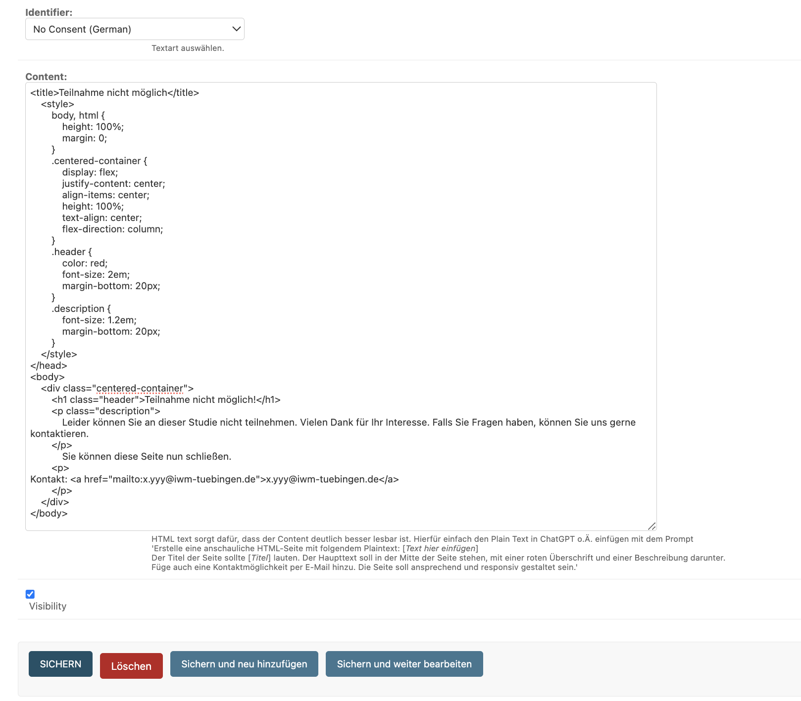

**Nicht zugelassen (not_eligible.html)**
- Zweck: Informiert Teilnehmende, die die Teilnahme abgelehnt haben oder nicht berechtigt sind.
- Merkmale:
  - Zeigt eine benutzerdefinierte Nachricht an.
  - Minimalistisches Design.

**Startseite (start.html)**
- Zweck: Erster Einstiegspunkt für Teilnehmende, mit Optionen zur Neuregistrierung oder zum Login.
- Merkmale:
  - Optionen: Button für neue Teilnehmende und bestehende Accounts.

**Ende des Experiments (end.html)**
- Zweck: Zeigt eine Dankesnachricht an und bietet die Möglichkeit, sich abzumelden.
- Merkmale:
  - Dynamische Inhalte: Überschrift und Nachricht werden aus der Datenbank geladen.
  - Logout-Button: Beendet die Sitzung.

**Funktionsweise von Headern und Nachrichten**
- Die Header und Nachrichten werden dynamisch aus der Datenbank geladen, basierend auf spezifischen Identifiers. Dies erlaubt eine flexible Anpassung der Inhalte durch den Admin, ohne den Code selbst ändern zu müssen.

- Ablauf der dynamischen Textintegration
1.	Modelle:
  - Es gibt ein Text-Modell mit den Feldern identifier, content und visibility.
  - Der identifier dient zur eindeutigen Identifikation eines bestimmten Inhalts (z. B. participant_info_header_en für die englische Überschrift der Teilnehmerinformation).
  - Der content enthält den eigentlichen Text, der angezeigt wird.
  - Das Feld visibility bestimmt, ob der Text aktuell sichtbar und aktiv ist.

Beispiel:
```bash
class Text(models.Model):
    identifier = models.CharField(max_length=200, choices=IDENTIFIER_CHOICES, unique=True)
    content = models.TextField()
    visibility = models.BooleanField(default=False)
```

2.	Views:
  - In der View wird die Datenbank abgefragt, um den passenden content für einen bestimmten identifier zu finden.
  - Wenn ein Eintrag mit visibility=True und passendem identifier existiert, wird dessen content geladen.
  - Falls kein passender Text gefunden wird, wird ein Standardtext angezeigt.

Beispiel:
```bash
def participant_info(request):
    participant_info_header = Text.objects.filter(visibility=True, identifier__startswith="participant_info_header").first()
    participant_info_message = Text.objects.filter(visibility=True, identifier__startswith="participant_info_message").first()

    return render(request, 'questions/participant_info.html', {
        'participant_info_header': participant_info_header.content if participant_info_header else "Default Header",
        'participant_info_message': participant_info_message.content if participant_info_message else "Default Message",
    })
```

3.	Templates:
  - Im Template werden die geladenen Inhalte mit Platzhaltern wie {{ participant_info_header }} oder {{ participant_info_message }} eingefügt.
  - Falls der Text HTML-Code enthält, wird durch |safe sichergestellt, dass dieser korrekt gerendert wird.
Beispiel:
```bash
<h1 class="ui dividing header">{{ participant_info_header | safe }}</h1>
<p class="description.participant.info">{{ participant_info_message | safe }}</p>
```

4.	Verwaltung über das Admin-Panel:
  - Im Django-Admin kannst du Text-Objekte erstellen oder bearbeiten.
  - Der identifier sorgt dafür, dass Inhalte gezielt zugeordnet und angepasst werden können.
  - Das Feld visibility legt fest, ob ein Text aktiv ist oder nicht.

5.	Internationalisierung:
  - Unterschiedliche Sprachen werden durch spezifische identifier-Namen unterstützt (z. B. _en für Englisch oder _de für Deutsch).
  - Views laden die passenden Inhalte basierend auf der Sprachlogik.

Beispiel:
```bash
participant_info_header_en: "Welcome to the Study"
participant_info_message_en: "Here is some important information..."
```
</details>

---

## Weitere Informationen

<details> 
<summary>🛠 Kleine Änderungen vornehmen</summary>

### So nimmst du kleine Änderungen im Code vor:
1. Öffne die entsprechende Datei in deinem Code-Editor.
2. Finde den Codeabschnitt, den du ändern möchtest.
3. Nimm die gewünschten Änderungen vor (z. B. Kommentiere Code aus oder füge neuen Code hinzu).
4. Speichere die Datei.
5. Starte den Server neu, damit die Änderungen wirksam werden.  (Baue ein neues Image, falls du Docker nutzt)

### Beispielhafte Schritte, um den "Cancel Experiment"-Button zu entfernen:

1. **Datei öffnen**:
   Öffne die Datei `navbar.html` in deinem Code-Editor.

2. **Button entfernen**:
   Finde den folgenden Codeabschnitt in der Datei:

   ```html
   <a href="" class="ui item">
     <i class="fas fa-sign-out-alt"></i>&nbsp;
     Cancel (Quit Experiment) 
   </a>

3. **Zeilen Auskommentieren über cmd+shift+7 (Mac)**
4. **Änderungen speichern**
5. **Server neu starten**

</details>

---

<details> 
<summary>User-Profile Duality</summary>

### Was ist der Unterschied zwischen `User` und `Profile`?
- **User**: Enthält grundlegende Informationen wie Benutzername und Passwort. Wird für die Anmeldung verwendet.
- **Profile**: Enthält zusätzliche Informationen wie Biografie, Profilbild und experimentelle Bedingungen. Wird für alles Tool-bezogene verwendet.

### Achtung: Variablennamen im Code
- Im Code wird oft `user` verwendet, obwohl eigentlich `profile` gemeint ist. Zum Beispiel: `user.user` bezieht sich auf das Profil des Benutzers.
- **Tipp**: Überprüfe immer, ob `user` oder `profile` gemeint ist, indem du den Kontext betrachtest.


Das Tool verwendet ein Framework für die Benutzerauthentifizierung, das eine eigene User-Klasse mitbringt. Zusätzlich wird bei der Erstellung eines Benutzers ein eigenes Profile-Objekt erstellt und mit dem neuen Benutzer verknüpft. Der User wird für die Authentifizierung verwendet (Anmeldename, automatisch generierte E-Mail), während das Profile für alles andere Tool-bezogene (Bio, ...) genutzt wird.

Es gibt einige doppelte Felder: firstname und lastname im User werden ignoriert, und die E-Mail im Profile wird ebenfalls ignoriert.


</details>
